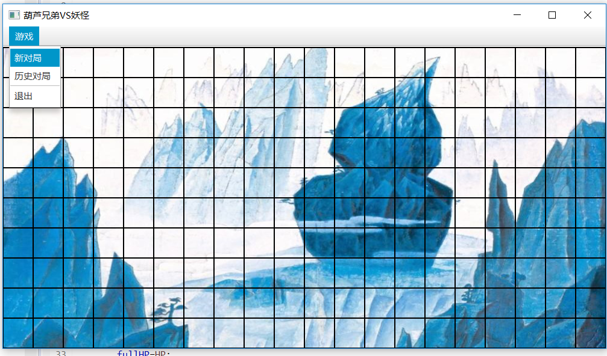
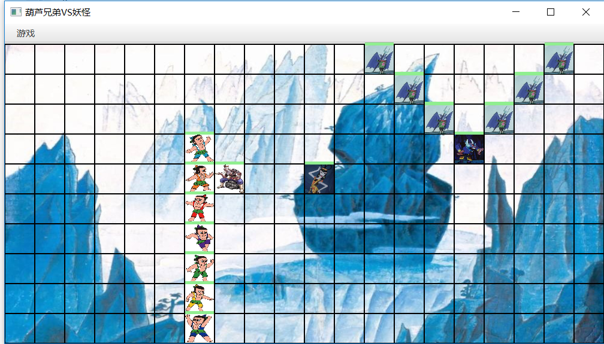
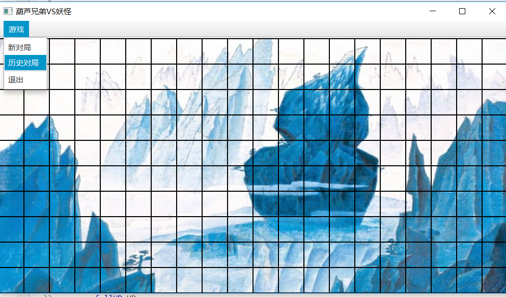
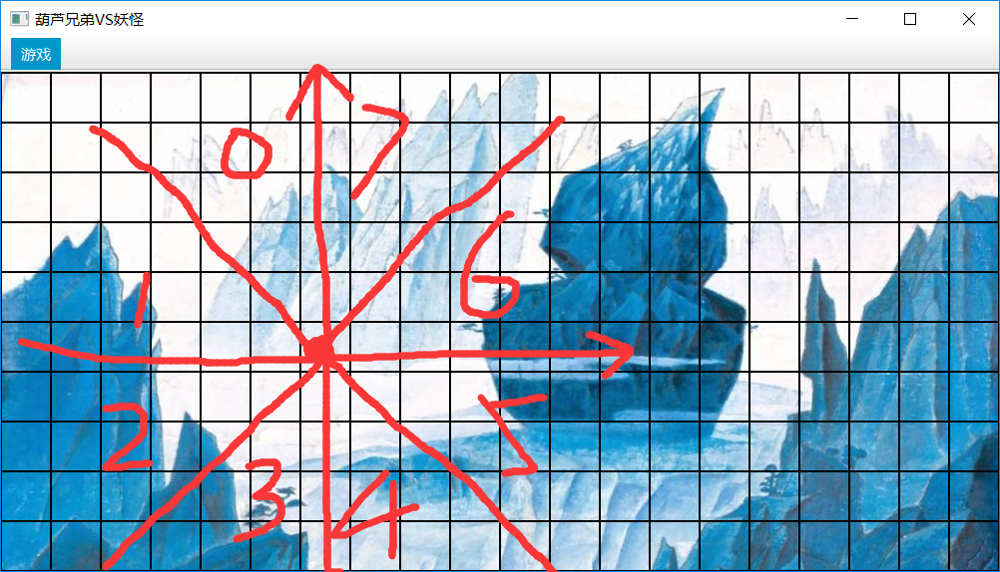
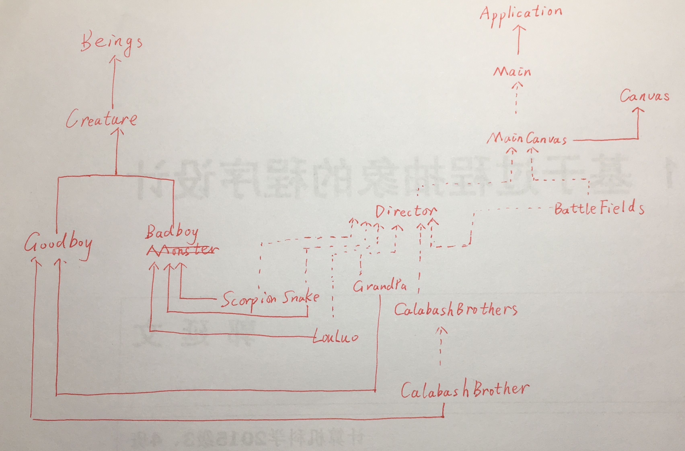
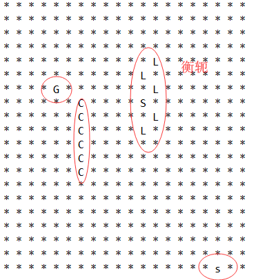

# Final Project：葫芦兄弟大战妖精
刘潇远
161220083
liuxy@smail.nju.edu.cn
# 一、综述
葫芦娃是我国动画界经典IP，与《西游记》一样，经常被人拿来使用。正如六小龄童六老师所说：“戏说不是胡说，改编不是乱编”，葫芦兄弟大战妖精的游戏还是应当遵照动画的原意。\
游戏提供简单的GUI界面，帧率高达10帧，提供了简单易用的操作方式，菜单栏选择进行新对局或回放历史对局，当功能选择好后，用户只需按下空格键，程序便会开始进行新对局或播放历史对局。鉴于游戏并不复杂，谁胜谁负一眼就能看出（~~其实是心累不想做了~~），所以并没有做胜利界面。
# 二、程序使用手册
## 1、开始一场新战役
#### 首先在菜单栏选择该功能

#### 选择完后，自动摆放阵型，此时按下空格战斗开始

## 2、回放历史战斗
#### 首先在菜单栏选择该功能

#### 在弹出的文件窗口选择要回放的文件，选择完后点击打开并按下空格开始回放。
#### 注意！所有战斗都会被自动保存，保存的文件名根据当前时间设置为年_月_日_时_分_秒.txt（yyyy_MM_dd_HH_mm_ss.txt)

# 三、架构解析
## 1、生物逻辑
每个生物都有许多属性，包括位置、攻击力、防御力与血量，这些属性都是根据动画中的相关剧情决定的。生物可以在战场上自由走动，走动方向的确定是根据与该生物之间曼哈顿距离最短的生物所处位置决定的，战场上分为八方：编号为0，1，2，3，4，5，6，7

生物按0~7的顺时针方向探测与自己曼哈顿距离最近的敌对生物，检测到后，会优先沿与该区域相邻的坐标防线前进，例如检测到曼哈顿距离最近的敌对生物在0区域，则首先会判断能否向上走，能则向上走一步，如果上方战场格子上有其他生物，则再判断能否向左走。\
这样游戏中的生物们很快就能进行战斗从而分出胜负。战斗时血量在70%以上血条为绿色，40%~60%为黄色，40%以下为红色

#### 葫芦娃🐸
*葫芦娃*是*葫芦兄弟*阵营的主力输出，具有高攻击力和较高的防御力。。
#### 爷爷👴
*爷爷*年老体衰，攻击力与防御力是所有生物中最低的。
#### 蝎子精🦂
*蝎子精*作为肉体最强生物，拥有远高（<300%）于其他生物的攻击力、防御力和血量。
#### 蛇精🐍
*蛇精*攻击力，防御力与血量一般。
#### 小喽啰🕷🦇
攻击力防御力弱，炮灰。
## 2、战场设计
战场为10\*20的矩形，其中左边10\*10的矩形是葫芦兄弟阵营（含7个葫芦娃和1个爷爷）的初始摆放处，右侧10\*10的矩形是妖精们（含多个小喽啰，1个蝎子精和1个蛇精）的初始摆放处，当用户点击*新对局*按钮时，双方会在自己的初始摆放处列阵。战场的每个格子都是一个战场格子类引用，如果该格子上有生物，则会使该引用指向一个实例化的战场格子，实例化战场格子中存有该生物的引用，同时该生物自己也存有自己所在战场坐标。\
列阵遵循随机原则，**葫芦兄弟**团结一线，总是摆出一字长蛇阵，共同面对敌人，将葫芦七兄弟按照作业二排序后，随机生成一个葫芦兄弟阵地的坐标，检测从该坐标起向下沿伸（沿x坐标增大的方向），如果能放下，则将葫芦兄弟放置在战场上，否则再次生成随机坐标，重复上述步骤。
**爷爷**在葫芦兄弟上场后登场，随机生成一个葫芦兄弟阵地的坐标，检测该位置，如果没有葫芦娃，则在此放下爷爷，否则重新生成随机坐标，重复上述操作。
**蝎子精**带领**小喽啰**先排阵型。随机选择一个阵型（鹤翼、雁行、衡轭、鱼鳞、方门、偃月和锋矢）后，生成相应数量的蝎子精和小喽啰，按照阵型个体摆放顺序放置在一个向量Vector中，之后随机生成一个妖怪阵营阵地的坐标，检测以该坐标为阵型所占最小矩形的左上角，能否在阵地中放置该阵型，能容纳则摆放该阵型，如果不能则重新生成随即坐标重复上述步骤。
**蛇精**的放置方式与**爷爷**相同，不做赘述。
## 3、并发控制
由于每个生物都是一个独立的个体，而且在现实世界中，每个个体的行为方式也都是不一样的，自然就需要将每个生物视为一个单独的线程，既然有了线程，就涉及到了并发，现在就来详细分析一下本程序中涉及到的并发问题。
### javaFX线程与Canvas线程
javaFX线程与Canvas线程分属两个线程，Canvas对于UI的所有操作都应当在写在匿名内部类中
```javascript
Platform.runLater(()->{
	...
});
```
### 同步问题
同步问题主要发生在生物在战场中移动时。当生物想要移动时，它首先会检测要移动方向上有没有其他生物阻挡，如果没有，则移动，如果有，则不移动，考虑以下两种情况：1、当生物A检测到临近某格子空，想要移动到该格子，此时另一生物B恰好在A检测完但还没来得及移动时移动到了A想要去的格子上，但A并不知道此事，于是A也移动到了该格子上了，于是含有B的实例化战场格子类便被含有A的实例化战场格子类覆盖掉了。2、当生物A检测到临近格子空，想要移动到改格子，此时另一生物B恰好在A检测完但是还没来得及移动时，想要移动到A的格子上，此时由于A还未移动，所以B认为不能移动，然而实际上A马上就要移开，B是可以移动到A的原位置的。为了解决这两个问题，将检测格子为空和移动到改格子这两个动作整合在一个方法中，并且该方法只允许一个进程进行调用
```javascript
//生物直接调用该方法，如果移动成功则返回true，不成功则返回false
public boolean SetBFPosition(int x, int y, Creature t) {
	synchronized(BattleFields.class){
		if(!isEmpty(x,y))return false;
		else {
			BFs[x][y]=new BattleField<Creature>(t);			
			return true;
		}
	}
}
```
**注意：本README第三部分2中并未写出synchronized关键字**
类似的问题还有：1、例如生物A想要移动到某个格子，就在A检测完还未移动时，B对该格子进行攻击，但发现格子为空，攻击落空，但实际上A移动过来被B攻击了。2、生物想要移动到某个格子，就在A检测完还未移动时，B对A进行攻击，A掉血，但是实际上A离开了，B的本次攻击落空。这个问题可以将取得战场某格子生物引用的方法设置为同时只能由一个线程访问解决。
还有一些其他的类似问题，解决方法和原理大都类似，不过多进行赘述
# 四、源码
## 1、依赖关系
凑合看看，**实线**代表继承自，**虚线**代表聚集


## 2、类与方法
#### package java2018.CalabashBrother.application
Main.java
```javascript
package java2018.CalabashBrother.application;
public class Main extends Application {
	//用以指示用户选择的功能
	private int play;

//菜单栏的高度，显示战场的时候要整体下移菜单栏高度
	static int menuBarHeight = 35;

	//功能选择和MainCanvas类的实例化
	@Override
	public void start(Stage primaryStage);
	
	//整个程序的入口
	public static void main(String[] args) {
		launch(args);
	}
}

```
MainCanvas.java
```javascript
package java2018.CalabashBrother.application;
public class MainCanvas extends Canvas{
	//葫芦娃阵营人数，归0时战斗结束
	private int goodboyCount = 8;
	
	//妖怪阵营人数，归0战斗结束。两阵营人数在新战役开始时都会被初始化，此处-1仅作为判断方便
	private int badboyCount = -1;

	//指示战斗是否开始，用以忽略战斗过程中用户的空格输入
	private boolean begin = false;

	//战场
	private BattleFields BFs;

	//战场的上帝视角
	private Director director;

	private GraphicsContext gc;
	
	//保存文件的路径
	private String fileName;

	//指示战役是否结束
	private boolean battleOver;

	//指示当前功能是新战役还是回放
	int play;

	//写文件器，在接收到保存文件路径时初始化
	private FileWriter writer;

	//读文件器，在接收到读入文件路径时初始化
	private  BufferedReader reader;
	
	//线程池
	ExecutorService exec = Executors.newCachedThreadPool();

	//菜单栏高度
	static int menuBarHeight = 35;

	//存有各类图片资源。背景及各类人物图像
	static Image BG;
	static Image CB1 = null;
	static Image CB2 = null;
	static Image CB3 = null;
	static Image CB4 = null;
	static Image CB5 = null;
	static Image CB6 = null;
	static Image CB7 = null;
	static Image GP = null;
	static Image LL = null;
	static Image SC = null;
	static Image SN = null;
	
	static {//加载图片
		try {
			BG = new Image(new File("resource/background.jpg").toURI().toURL().toString());
			CB1 = new Image(new File("resource/1.jpg").toURI().toURL().toString());
			CB2 = new Image(new File("resource/2.jpg").toURI().toURL().toString());
			CB3 = new Image(new File("resource/3.jpg").toURI().toURL().toString());
			CB4 = new Image(new File("resource/4.jpg").toURI().toURL().toString());
			CB5 = new Image(new File("resource/5.jpg").toURI().toURL().toString());
			CB6 = new Image(new File("resource/6.jpg").toURI().toURL().toString());
			CB7 = new Image(new File("resource/7.jpg").toURI().toURL().toString());
			GP = new Image(new File("resource/Grandpa.jpg").toURI().toURL().toString());
			LL = new Image(new File("resource/LouLuo.jpg").toURI().toURL().toString());
			SC = new Image(new File("resource/Scopion.jpg").toURI().toURL().toString());
			SN = new Image(new File("resource/Snake.jpg").toURI().toURL().toString());
		}catch(Exception e) {
			e.printStackTrace();
		}
	}

	//MainCanvas类本身也是一个线程，不断刷新UI
	private Thread thread = new Thread(new Runnable() {
		@Override
		public void run();
	});

	//构造函数，初始化
	public MainCanvas();

	//用户按下空格后，开始进行新战役或回放
	public void flashBegin();

	//绘制背景及格子
	public void drawBackground();

	//新战役，用以重新初始化各种属性和准备新线程
	public void newWar();

	//新战役中，画出当前战场情况
	public void draw();

	//战斗是否结束
	public boolean isBattleOver();

	//用户选择新战役并按下空格后会调用该方法，用以开始所有线程
	public void creatureThreadRun();

	//用户选择功能时会调用此方法设置功能
	public void setPlay(int play);

	//用户选择回放时会传入文件路径，此方法用以接收文件路径
	public void setFileName(String fileName);

	//回放一张画面
	public void replay(); 

	//将此时的战场情况写入文件
	public void saveBattleField();
}

```


#### package Beings
Beings.java
```javascript

package java2018.CalabashBrother.Beings;
//生物的父类
public class Beings {
    //坐标
	protected int x, y;
	//移动
	public void MoveToPos(int x, int y)
}
```

Creature.java
```javascript
//本类是葫芦娃、爷爷、蝎子精、蛇精、小喽啰的父类，是Beings的派生类
package java2018.CalabashBrother.Beings;
public class Creature extends Beings implements Runnable{
    //攻击力Combat Effectiveness
	protected int CE;

    //防御力Defence
	protected int DEF;

    //血量Health Point
	protected int HP;

	//初始血量
	protected int fullHP;
    //存活状态
	protected boolean livingStatus;

    //取攻击力
    public int getCE(int radio);

	//取防御力
    public int getDEF();

	//取血量
    public int getHP();

	//取初始血量
	public int getFullHP();

    //取存活状态
	public boolean isLiving();

    //攻击
	public void Attack(Creature attackedBeing,int radio);
	
	//while循环，循环条件是该生物存活，循环体中生物不断移动并对周围敌对生物发起攻击。线程每执行一个循环都要随机sleep一到两秒
	public void run();
}
```
Goodboy.java
```javascript
//葫芦娃和爷爷的父类，用以敌对阵营的鉴别
package java2018.CalabashBrother.Beings;
public class Goodboy extends Creature{
	Goodboy(int CE, int DEF, int HP){
		super(CE,DEF,HP);
	}
	Goodboy(int CE, int DEF, int HP, boolean Motivated){
		super(CE,DEF,HP,Motivated);
	}
	Goodboy(int CE, int DEF, int HP, boolean Motivated, BattleFields BFs){
		super(CE,DEF,HP,Motivated,BFs);
	}
	
}
```

Badboy.java
```javascript
//小喽啰、蛇精和蝎子精的父类，用以敌对阵营的鉴别
package java2018.CalabashBrother.Beings;
public class Badboy extends Creature{
	Badboy(int CE, int DEF, int HP){
		super(CE,DEF,HP);
	}
	Badboy(int CE, int DEF, int HP, boolean Motivated){
		super(CE,DEF,HP,Motivated);
	}
	Badboy(int CE, int DEF, int HP, boolean Motivated, BattleFields BFs){
		super(CE,DEF,HP,Motivated,BFs);
	}
}

```

NameAndColor.java
```javascript

//用enum类型将葫芦娃排行与颜色绑定
package java2018.CalabashBrother.Beings;
public enum NameAndColor {//
	RED, ORANGE, YELLOW, GREEN, CYAN, BLUE, PURPLE;
	String[] NAME = {"老大", "老二", "老三", "老四", "老五", "老六", "老七"};
	String[] COLOR = {"赤", "橙", "黄", "绿", "青", "蓝", "紫"};
	
	//取名字
	String getName() {
		return this.NAME[ordinal()];
	}
	
	//取颜色
	String getColor() {
		return this.COLOR[ordinal()];
	}
}
```

CalaBashBrother.java
```javascript
package java2018.CalabashBrother.Beings;
public class CalabashBrother extends Creature{

	private NameAndColor nc;
    
	//默认构造函数
	CalabashBrother();
   
    //带参构造函数
	CalabashBrother(NameAndColor NC);
	CalabashBrother(int x, int y);
	CalabashBrother(int x, int y, NameAndColor NC);

	//取名字
    public String getName();

	//取颜色
    public String getColor();
	
	//设置颜色和名字，对应上面的enum类型
    public void setNameAndColor(int index);
 
    //比较函数，用于作业二排序
	public int compareTo(CalabashBrother brother);
}
```

CalabashBrothers.java

```javascript
package Beings;
public class CalabashBrothers {
    //七个葫芦兄弟
	private CalabashBrother[] calabashbrothers;
    //默认构造函数
	public CalabashBrothers();//设置位置
	public void SetCBPostion(int index, int x, int y);
	//作业二排序交换位置
	public void SwapBrother(int index1, int index2);
    //取index位置的葫芦娃
	public CalabashBrother getBrother(int index);
    //取index位置的葫芦娃的名字
	public String getName(int index);
    //取index位置的葫芦娃名字
	public String getColor(int index);
    //作业二输出当前葫芦兄弟队的情况
	public void QueueNameStatus();
	public void QueueColorStatus();
    //作业二打乱葫芦兄弟队伍
	public void Disorder();
}

```

GrandPa.java
```javascript
package Beings;
public class GrandPa extends Creature{
	//构造函数
	public GrandPa();
}
```

Scorpion.java
```javascript
package Beings;
//蝎子精
public class Scorpion extends Creature{
	//构造函数
	public Scorpion();
}
```

Snake.java
```javascript
package Beings;

public class Snake extends Creature{
	//构造函数
	public Snake();
}

```

LouLuo.java
```javascript
package Beings;
public class LouLuo extends Creature{
	//构造函数
	public LouLuo();
}

```
#### package java2018.CalabashBrother.BattleField
BattleField.java
```javascript
//泛型，可存放所有物体
package  java2018.CalabashBrother.BattleField;
import Beings.*;
public class BattleField<T extends Beings> {

    //本块场地中的物体
	private T Being;

    //默认构造函数
	BattleField();

    //带参构造函数
	BattleField(T t);

    //查看格子是否为空
	public boolean isEmpty()；

    //取得本格子上的物体
	public T getBeing()；

    //把格子上的物体移走
	public T removeBeing()；
}
```

BattleFields.java
**注意：本类中大部分方法不需要检测某位置是否为空就可以直接调用，为空或者越界时返回null**
```javascript
package  java2018.CalabashBrother.BattleField;
import java.util.*;
import Beings.*;
public class BattleFields {
	//战场为M*N的矩形
	
   
    //场地长
	private int M;
	
	//场地宽
    private int N;
   
    //场地
	private  BattleField BFs[][];
   
    //默认构造函数
	public BattleFields();
   
    //带参构造函数
	BattleFields(int m, int n);

	//初始化场地。实际上就是将所有格子都赋空指针
	public void 
	
	initializeBattleField();
   
    //作业三，场地能否容纳阵型
	public boolean Containable(int x, int y, int length, int height);
  	
	//将某位置清空  
	public void remove(int x, int y);

	//生物要移动时，调用该方法寻找方向
	public int findDirection(Creature c,int x, int y);

	//战场(x,y)位置是否空。本方法在下一个方法中被调用
	public boolean isEmpty(int x, int y)；

    //在战场(x,y)位置放置物体t
	public boolean SetBFPosition(int x, int y, Beings t);

	//取得战场(x,y)位置生物阵营
	public String creatureType(int x, int y);

	//取得战场(x,y)位置生物具体名字
	public String CBName(int x, int y);

	//取得战场(x,y)位置生物引用。位置空返回null
	public Creature  getCreature(int x, int y);
	//命令行输出战场情况
	public void BFOutput();

}
```
#### package java2018.CalabashBrother.Director
Director.java
```javascript
package java2018.CalabashBrother.Director;
public class Director {
	//战场
	private BattleFields BFs;

	//葫芦兄弟们。这个对象实际上已经没有用了，是作业二的遗产代码
	private CalabashBrothers CBs;

	//默认构造函数
	Director()；

	//带参构造函数
	Director(BattleFields bfs)；

	//带参构造函数
	Director(BattleFields bfs, CalabashBrothers cbs)；

	//在某位置摆放。两个重载，第一个是摆放爷爷和蛇精，第二个是摆放葫芦兄弟和蝎子精与小喽啰们，他们储存在Vector向量中
	public boolean setFormation(int x, int y, int biasY, Creature t)；
	public boolean setFormation(int x, int y, int biasY, String formationName,Vector<Creature>list)；
	
	//输出名字状态。两个重载
	public void QueueNameStatus()；
	public void QueueNameStatus(CalabashBrothers calabashbrothers)；
	
	//输出颜色状态。两个重载
	public void QueueColorStatus()；
	public void QueueColorStatus(CalabashBrothers calabashbrothers)；
	
	//冒泡排序。两个重载
	public void BubbleSort();
	public static void BubbleSort(CalabashBrothers calabashbrothers);
	
	//快速排序。两个重载
	private int Partition(int p, int r);
	public void QuickSort(int p, int r);
	
	private static int Partition(CalabashBrothers calabashbrothers, int p, int r);
	public static void QuickSort(CalabashBrothers calabashbrothers, int p, int r);

	//将葫芦娃的顺序打乱
	public void Disorder();
	public CalabashBrother getBrother(int index);

	//列阵
	public void setPos();
	//显示战场情况
	public void showBF();

	//清空战场
	public void clearBattleField();
	
}
```
#### package java2018.CalabashBrother.Randomnum
```javascript
package java2018.CalabashBrother.Randomnum;
public class Randomnum {

	//Random类。只在第一次初始化
	static Random r = new Random();

	//产生一个在[0,upline)范围内的随机整数
	public static int getRandom(int upLine);
}
```
# 五、其他
#### 感谢老师们和助教们一个学期的辛苦工作
我在这门课里面，主要的收获是学习并实践了并发，并且在另一门课里面使用到了并发排序。\
写大作业的过程很痛苦，但是总算是做了一个勉强能运行的程序。我发现一个程序的完成，不仅难在核心算法（本程序中是并发），更难在整体设计和细节完善上，很多我预想的功能最终都没有实现。很多小功能尽管乍眼一看不难，但是把这个功能添加进去却要经过编码和调试的两个过程，还要考虑怎么与已有数据结构和代码结构进行兼容。
路漫漫其修远兮，吾将上下而求索。

---------------------------------------
-----------------------------
---------------------------------
# 作业三：葫芦娃大战妖精
# 一、物体
物体有自己在场地的坐标(x,y)
## 生物
生物是物体的继承类，除了有坐标外，还有攻击力、防御力和血量三个生物属性。\
生物分为两个阵营，一方是**葫芦兄弟阵营**，另一方是**妖怪阵营**。\
生物有两种，一种是能够**直接进行攻击的生物**，包括葫芦娃、蝎子精和小喽啰；另一种是不能攻击，但当其在场上时，能够**对本阵营产生正面buff、对敌对阵营产生负面buff**，包括爷爷和蛇精两种。
#### 1、葫芦娃🐸
*葫芦娃*是*葫芦兄弟*阵营的主力输出，具有高攻击力和较高的防御力。每个*葫芦娃*还根据自身特点附带技能，**老大**力大无穷，攻击易*暴击*，**老二**千里眼顺风耳，*命中率*和*闪避率*高，**老三**铜头铁臂，钢筋铁骨，有几率*反弹攻击*，**老四**会玩火，攻击附带*持续灼烧伤害*，**老五**会玩水，攻击附带*持续冰冻伤害*，并能够*降低命中者攻速*，**老六**会隐身术，攻击有几率触发*刺杀*，直接杀死被命中者，**老七**有宝葫芦，攻击有几率触发*我叫你一声你敢答应吗*技能，触发后将敌方单位吸入葫芦，基础时间为2秒，受buff影响。\
尽管*葫芦兄弟*天生就有高额攻击和防御，但都是小孩子，受*爷爷*影响大，如果***爷爷*阵亡**，则*葫芦兄弟*技能就失去作用，如果*蛇精*在场，*老七*会受其*蛊惑*，变为*妖怪阵营*成员，同时随机对除自身外在场的一名*葫芦娃*使用*我叫你一声你敢答应吗*技能。
#### 2、爷爷👴
*爷爷*年老体衰，攻击力与防御力是所有生物中最低的。*爷爷*在场时，*葫芦兄弟*的特殊技能全部生效。\
*爷爷*唯一的技能是*浇水*，每3秒恢复场上每个*葫芦娃*5%的*生命值*
#### 3、蝎子精🦂
*蝎子精*作为肉体最强生物，拥有远高（<300%）于其他生物的攻击力、防御力和血量。\
*蝎子精*的技能为*振奋*，每三次攻击产生一次*暴击*。
####4、蛇精🐍
*蛇精*没有攻击力，防御力与血量一般。\
*蛇精*的技能为*魅惑*，*精神冲击*和*舍人为己*。*魅惑*能够使对方精神错乱攻击友军，*精神冲击*能够使对方精神错乱不能攻击，二者的持续时间都为1秒钟，二者同属精神类攻击，当*爷爷*在场时不能产生效果。*舍人为己*随机选定一名*小喽啰*，替*蛇精*承受一次攻击，本次攻击中，*蛇精*不受伤害，*小喽啰*受到120%的伤害
####5、小喽啰🕷🦇
攻击力防御力弱，炮灰，没有技能。
## 攻击波
生物攻击时，会发出攻击波，攻击波在场地中飞行，每秒飞行一距离。遇到第一个敌人时产生效果并结束。
# 二、场地
## 区域
作战场地为默认为20\*20的正方形，初始时，葫芦兄弟阵营站在左侧20\*10的矩形中，妖怪阵营站在右侧，当战斗开始时，两阵营人物可在整个阵地（包括己方和对方阵地）上自由走动。
## 阵型
作战前首先要摆放阵型。每个阵营只能在自己的阵地摆放阵型，每个阵型将占有能够容纳它的最小的矩形，例如鹤翼阵需要占用7*4大小的矩形。\
摆放时，接收一个坐标输入(x,y)，指示上述矩形的左上角位置，根据左上角位置和矩形大小判断能够在本阵营区域摆放阵型。
#### 1、葫芦兄弟
葫芦兄弟只有一个阵型——长蛇阵，爷爷自己一个阵型，可以摆放在任意位置（如果你不想他死那么快就请把他放在葫芦娃身后）
#### 2、妖怪
妖怪有八种阵型——鹤翼、雁行、衡轭、长蛇、鱼鳞、方门、偃月和锋矢。其中蝎子精处于阵型最中央，身先士卒，勇气可嘉，阵型的其他位置都是小喽啰。蛇精也可以摆放在场地的任何位置（同样的如果你不想她死那么快就请把她放在妖怪们身后）
## 摆阵
**葫芦兄弟**团结一线，总是摆出一字长蛇阵，共同面对敌人，将葫芦七兄弟按照作业二排序后，随机生成一个葫芦兄弟阵地的坐标，检测从该坐标起向下沿伸（沿x坐标增大的方向），如果能放下，则将葫芦兄弟放置在战场上，否则再次生成随机坐标，重复上述步骤。
**爷爷**在葫芦兄弟上场后登场，随机生成一个葫芦兄弟阵地的坐标，检测该位置，如果没有葫芦娃，则在此放下爷爷，否则重新生成随机坐标，重复上述操作。
**蝎子精**带领**小喽啰**先排阵型。随机选择一个阵型后，生成相应数量的蝎子精和小喽啰，按照阵型个体摆放顺序放置在一个向量Vector中，之后随机生成一个妖怪阵营阵地的坐标，检测以该坐标为阵型所占最小矩形的左上角，能否在阵地中放置该阵型，能容纳则摆放该阵型，如果不能则重新生成随即坐标重复上述步骤。
**蛇精**的放置方式与**爷爷**相同，不做赘述。
## _作业三_
按照上述步骤在阵地中摆放好两阵营人物后，输出阵地情况，阵地中空位用*表示，葫芦兄弟用C表示，爷爷用G表示，小喽啰用L表示，蝎子精用大写S表示，蛇精用小写s表示。如下是某次程序运行结果。

# 三、GUI
# 四、Multithreading
# 五、类及类间关系
#### package Beings
Beings.java
```javascript
package Beings;

//本类是生物和攻击波的父类
public class Beings {
    //坐标
	protected int x, y;
	//移动
	public void MoveToPos(int x, int y)
}
```

Creature.java
```javascript
//本类是葫芦娃、爷爷、蝎子精、蛇精、小喽啰的父类，是Beings的派生类
package Beings;
public class Creature extends Beings{
    //攻击力Combat Effectiveness
	protected int CE;
    //防御力Defence
	protected int DEF;
    //血量Health Point
	protected int HP;
    //buff状态
	protected boolean Motivated;
    //存活状态
	protected boolean livingStatus;
    //取攻击力
    public int getCE(int radio);
	//取防御力
    public int getDEF();
	//取血量
    public int getHP();
    //取buff状态
	public boolean isMotivated();
    //取存活状态
	public boolean isLiving();
    //设置buff状态
	public void setMotivated(boolean Motivated);
    //攻击
	public void Attack(Creature attackedBeing,int radio);
}
```

CalaBashBrother.java
```javascript
package Beings;
enum NameAndColor {//
	RED, ORANGE, YELLOW, GREEN, CYAN, BLUE, PURPLE;
	String[] NAME = {"老大", "老二", "老三", "老四", "老五", "老六", "老七"};
	String[] COLOR = {"赤", "橙", "黄", "绿", "青", "蓝", "紫"};
	//取名字
    String getName() ;
	//取颜色
    String getColor();
}
public class CalabashBrother extends Creature{

	private NameAndColor nc;
    //默认构造函数
	CalabashBrother();
    //带参构造函数
	CalabashBrother(NameAndColor NC);
	CalabashBrother(int x, int y);
	CalabashBrother(int x, int y, NameAndColor NC);
	//取名字
    public String getName();
	//取颜色
    public String getColor();
	//设置颜色和名字，对应上面的enum类型
    public void setNameAndColor(int index);
    //比较函数，用于作业二排序
	public int compareTo(CalabashBrother brother);
}
```

CalabashBrothers.java

```javascript
package Beings;
public class CalabashBrothers {
    //七个葫芦兄弟
	private CalabashBrother[] calabashbrothers;
    //默认构造函数
	public CalabashBrothers();//设置位置
	public void SetCBPostion(int index, int x, int y);
	//作业二排序交换位置
	public void SwapBrother(int index1, int index2);
    //取index位置的葫芦娃
	public CalabashBrother getBrother(int index);
    //取index位置的葫芦娃的名字
	public String getName(int index);
    //取index位置的葫芦娃名字
	public String getColor(int index);
    //作业二输出当前葫芦兄弟队的情况
	public void QueueNameStatus();
	public void QueueColorStatus();
    //作业二打乱葫芦兄弟队伍
	public void Disorder();
}

```

GrandPa.java
```javascript
package Beings;
public class GrandPa extends Creature{
	//构造函数
	public GrandPa();
}
```

Scorpion.java
```javascript
package Beings;
//蝎子精
public class Scorpion extends Creature{
	//构造函数
	public Scorpion();
}
```

Snake.java
```javascript
package Beings;

public class Snake extends Creature{
	//构造函数
	public Snake();
}

```

LouLuo.java
```javascript
package Beings;
public class LouLuo extends Creature{
	//构造函数
	public LouLuo();
}

```
#### package BattleField
BattleField.java
```javascript
//泛型，可存放所有物体
package BattleField;
import Beings.*;
public class BattleField<T extends Beings> {
    //本块场地中的物体
	private T Being;
    //默认构造函数
	BattleField();
    //带参构造函数
	BattleField(T t);
    //查看格子是否为空
	public boolean isEmpty()；
    //取得本格子上的物体
	public T getBeing()；
    //把格子上的物体移走
	public T removeBeing()；
    //在格子上放上物体。已内嵌removeBeing方法
	public boolean setBeing(T t)；
}
```

BattleFields.java
```javascript
package BattleField;
import java.util.*;
import Beings.*;
public class BattleFields {//战场为M*N的矩形
    //场地长
	private int M;
	//场地宽
    private int N;
    //场地
	private  BattleField BFs[][];
    //默认构造函数
	public BattleFields();
    //带参构造函数
	BattleFields(int m, int n);
	//初始化场地。实际上就是将所有格子都赋空指针
	public void initializeBattleField();
    //作业三，场地能否容纳阵型
	public boolean Containable(int x, int y, int length, int height);
    //在战场(x,y)位置放置物体t
	public boolean SetBFPosition(int x, int y, Beings t);
	//输出战场情况
	public void BFOutput();

}
```
#### package main
Director.java
```javascript
import java.lang.*;
import java.util.*;
import BattleField.*;
import Beings.*;
import java.util.concurrent.*;
public class Director {
	//战场
	private BattleFields BFs;
	//葫芦兄弟们。这个对象实际上已经没有用了，是作业二的遗产代码
	private CalabashBrothers CBs;
	//默认构造函数
	Director()；
	//带参构造函数
	Director(BattleFields bfs)；
	//带参构造函数
	Director(BattleFields bfs, CalabashBrothers cbs)；
	//在某位置摆放。两个重载，第一个是摆放爷爷和蛇精，第二个是摆放葫芦兄弟和蝎子精与小喽啰们，他们储存在Vector向量中
	public boolean setFormation(int x, int y, int biasY, Creature t)；
	public boolean setFormation(int x, int y, int biasY, String formationName,Vector<Creature>list)；
	
	//输出名字状态。两个重载
	public void QueueNameStatus()；
	public void QueueNameStatus(CalabashBrothers calabashbrothers)；
	
	//输出颜色状态。两个重载
	public void QueueColorStatus()；
	public void QueueColorStatus(CalabashBrothers calabashbrothers)；
	
	//冒泡排序。两个重载
	public void BubbleSort();
	public static void BubbleSort(CalabashBrothers calabashbrothers);
	
	//快速排序。两个重载
	private int Partition(int p, int r);
	public void QuickSort(int p, int r);
	
	private static int Partition(CalabashBrothers calabashbrothers, int p, int r);
	public static void QuickSort(CalabashBrothers calabashbrothers, int p, int r);
	//将葫芦娃的顺序打乱
	public void Disorder();
	public CalabashBrother getBrother(int index);
	//显示战场情况
	public void showBF();
	//清空战场
	public void clearBattleField();
	//主函数
	public static void main(String[] args);
	
}
```
#### package Randomnum
```javascript
import java.util.Random;
public class Randomnum {
	//Random类。只在第一次初始化
	static Random r = new Random();
	//产生一个在[0,upline)范围内的随机整数
	public static int getRandom(int upLine);
}
```